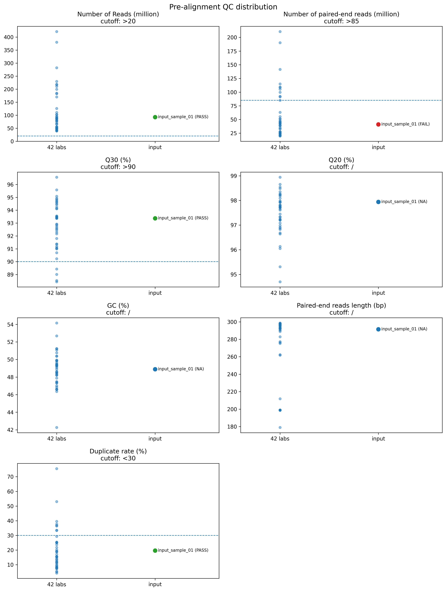
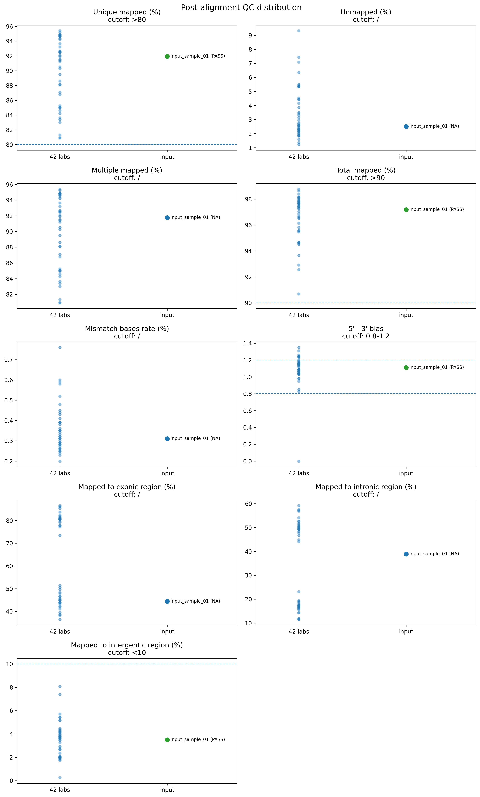
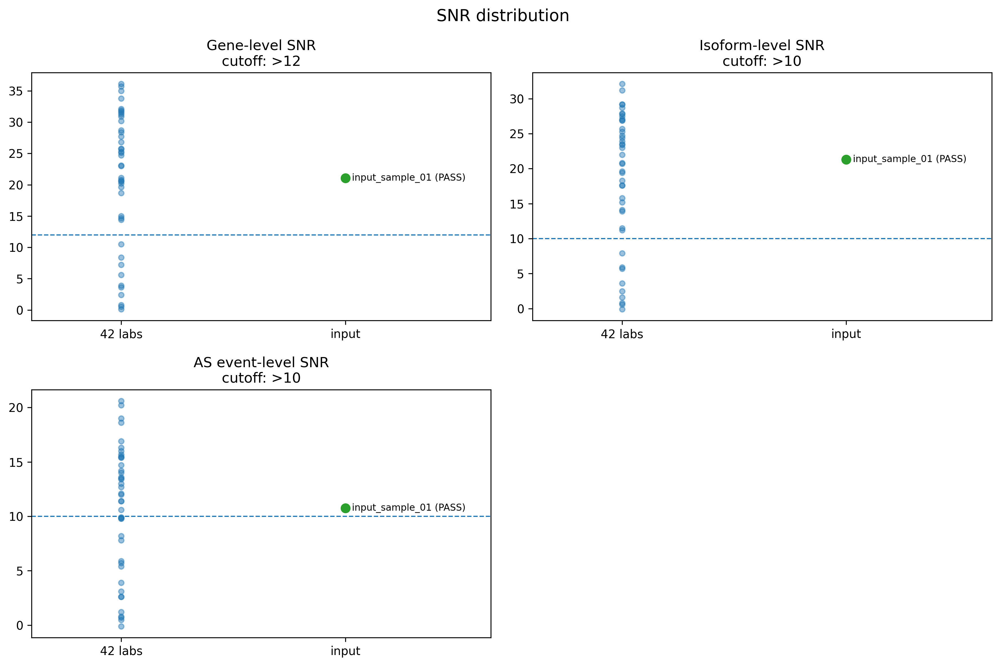

## Basic QC Metrics, QC Cutoffs, and Visualization

As shown in **Table**, four QC tools should be run to assess the basic sequencing quality parameters:

*   **FastQC**
*   **FastQ Screen**
*   **Qualimap**
*   **RSeQC**

The resulting QC metrics should then be evaluated against the **QC cutoff thresholds** provided in the reference table to determine whether sequencing quality passes or fails.

```plaintext
Basic QC Metrics
```

### Metric categories and source tools

| Category | Metric | Source tool / workflow |
| --- | --- | --- |
| Pre-alignment QC | Strand specificity | RSeQC |
| Pre-alignment QC | Number of Reads (million) | FastQC / FastQ Screen |
| Pre-alignment QC | Number of paired-end reads (million) | FastQC / FastQ Screen |
| Pre-alignment QC | Q30 (%) | FastQC |
| Pre-alignment QC | Q20 (%) | FastQC |
| Pre-alignment QC | GC (%) | FastQC |
| Pre-alignment QC | Paired-end reads length (bp) | FastQC |
| Pre-alignment QC | Duplicate rate (%) | FastQC / Qualimap |
| Post-alignment QC | Unique mapped (%) | Qualimap |
| Post-alignment QC | Unmapped (%) | Qualimap |
| Post-alignment QC | Multiple mapped (%) | Qualimap |
| Post-alignment QC | Total mapped (%) | Qualimap |
| Post-alignment QC | Mismatch bases rate (%) | Qualimap |
| Post-alignment QC | 5' - 3' bias | Qualimap / RSeQC |
| Post-alignment QC | Mapped to exonic region (%) | Qualimap |
| Post-alignment QC | Mapped to intronic region (%) | Qualimap |
| Post-alignment QC | Mapped to intergentic region (%) | Qualimap |
| SNR | Gene-level SNR | STAR-StringTie-SUPPA2 TPM/PSI-based analysis |
| SNR | Isoform-level SNR | STAR-StringTie-SUPPA2 TPM/PSI-based analysis |
| SNR | AS event-level SNR | STAR-StringTie-SUPPA2 TPM/PSI-based analysis |

## Template for Reporting Basic QC Metrics

| Sample | Strand specificity | Number of Reads (million) | Number of paired-end reads (million) | Q30 (%) | Q20 (%) | GC (%) | Paired-end reads length (bp) | Duplicate rate (%) | Unique mapped (%) | Unmapped (%) | Multiple mapped (%) | Total mapped (%) | Mismatch bases rate (%) | 5' - 3' bias | Mapped to exonic region (%) | Mapped to intronic region (%) | Mapped to intergentic region (%) | Gene-level SNR | Isoform-level SNR | AS event-level SNR |
| --- | --- | --- | --- | --- | --- | --- | --- | --- | --- | --- | --- | --- | --- | --- | --- | --- | --- | --- | --- | --- |
| example\_sample | 0.98 | 50.00 | 25.00 | 93.00 | 97.00 | 49.00 | 150 | 12.00 | 92.00 | 3.00 | 5.00 | 97.00 | 0.30 | 1.05 | 80.00 | 17.00 | 3.00 | 25.00 | 22.00 | 12.00 |

## QC Cutoff Thresholds

The following QC thresholds are used to determine whether sequencing quality passes or fails.

| Metric | QC cutoff |
| --- | --- |
| Number of Reads (million) | &gt;20 |
| Number of paired-end reads (million) | &gt;85 |
| Q30 (%) | &gt;90 |
| Q20 (%) | / |
| GC (%) | / |
| Paired-end reads length (bp) | / |
| Duplicate rate (%) | &lt;30 |
| Unique mapped (%) | &gt;80 |
| Unmapped (%) | / |
| Multiple mapped (%) | / |
| Total mapped (%) | &gt;90 |
| Mismatch bases rate (%) | / |
| 5' - 3' bias | 0.8-1.2 |
| Mapped to exonic region (%) | / |
| Mapped to intronic region (%) | / |
| Mapped to intergentic region (%) | &lt;10 |
| Gene-level SNR | &gt;12 |
| Isoform-level SNR | &gt;10 |
| AS event-level SNR | &gt;10 |

&gt; `/` indicates that no fixed QC cutoff is currently applied for that metric.

## Distribution of QC Metrics Across 42 Laboratories

The following values summarize the distribution of QC metrics across 42 laboratories and provide the background against which an input sample should be compared.

### 42-laboratory QC reference table

| lab | Number of Reads (million) | Number of paired-end reads (million) | Q30 (%) | Q20 (%) | GC (%) | Paired-end reads length (bp) | Duplicate rate (%) | Unique mapped (%) | Unmapped (%) | Multiple mapped (%) | Total mapped (%) | Mismatch bases rate (%) | 5' - 3' bias | Mapped to exonic region (%) | Mapped to intronic region (%) | Mapped to intergentic region (%) | Gene-level SNR | Isoform-level SNR | AS event-level SNR |
| --- | --- | --- | --- | --- | --- | --- | --- | --- | --- | --- | --- | --- | --- | --- | --- | --- | --- | --- | --- |
| lab01 | 55.3 | 27.65 | 93.44 | 97.71 | 49.87 | 297.94 | 15.21 | 94.63 | 2.6 | 94.63 | 97.4 | 0.29 | 1.06 | 82.4 | 15.59 | 2.01 | 33.8 | 29.2 | 15.5 |
| lab03 | 199.37 | 99.69 | 91.8 | 96.87 | 49.87 | 293.17 | 18.63 | 84.24 | 3.5 | 84.24 | 96.51 | 0.36 | 1.04 | 44.81 | 50.02 | 5.17 | 15 | 13.9 | 9.8 |
| lab04 | 218.68 | 109.34 | 94.51 | 98.09 | 50.38 | 292.56 | 29.28 | 84.58 | 2.96 | 84.58 | 97.04 | 0.25 | 1.04 | 45.54 | 49.29 | 5.18 | 14.4 | 14.1 | 12.1 |
| lab05 | 56.35 | 28.18 | 92.88 | 97.45 | 47.35 | 295.67 | 18.92 | 94.79 | 2.32 | 94.79 | 97.68 | 0.35 | 1.16 | 80.54 | 17.47 | 2 | 35 | 27.9 | 11.4 |
| lab06 | 101.87 | 50.94 | 91.03 | 97.92 | 48.48 | 198.94 | 10.61 | 88.13 | 2.28 | 88.13 | 97.72 | 0.26 | 1.09 | 51.37 | 44.87 | 3.76 | 3.9 | 3.6 | 2.6 |
| lab07 | 54.59 | 27.29 | 88.53 | 95.31 | 54.16 | 293.22 | 9.65 | 80.91 | 5.44 | 80.91 | 94.57 | 0.59 | 0.98 | 50.51 | 44.04 | 5.45 | 0.5 | 0.6 | 0.8 |
| lab08 | 78.38 | 39.19 | 90.23 | 96.05 | 47.88 | 290.28 | 12.74 | 91.4 | 2.18 | 91.4 | 97.82 | 0.44 | 1.13 | 49.64 | 46.7 | 3.66 | 31.2 | 26.9 | 13.6 |
| lab09 | 50.88 | 25.44 | 95.58 | 98.48 | 51.07 | 211.83 | 13.6 | 86.76 | 1.83 | 86.76 | 98.17 | 0.2 | 1.2 | 42.31 | 50.3 | 7.39 | 20.2 | 20.8 | 7.8 |
| lab10 | 102.8 | 51.4 | 93.51 | 97.74 | 46.64 | 295 | 25.12 | 92.09 | 1.99 | 92.09 | 98.01 | 0.25 | 1.15 | 48.44 | 47.79 | 3.77 | 14.7 | 11.2 | 3.1 |
| lab11 | 48.89 | 24.44 | 94.84 | 98.27 | 50.39 | 276.28 | 25.22 | 94.2 | 2.15 | 94.2 | 97.85 | 0.27 | 1.12 | 77.83 | 17.98 | 4.19 | 25.7 | 23.5 | 15.4 |
| lab12 | 182.9 | 91.45 | 94.11 | 97.98 | 46.62 | 293.17 | 36.72 | 91.2 | 1.87 | 91.2 | 98.14 | 0.26 | 1.09 | 46.52 | 49.6 | 3.89 | 25.3 | 24.7 | 16 |
| lab13 | 83.39 | 41.69 | 91.37 | 96.82 | 48.5 | 298.17 | 15.26 | 94.73 | 2.74 | 94.73 | 97.26 | 0.39 | 1.16 | 83.76 | 14.32 | 1.93 | 25.8 | 25.7 | 15.7 |
| lab14 | 170.24 | 85.12 | 94.93 | 98.65 | 48.66 | 198.44 | 11.41 | 93.64 | 1.22 | 93.64 | 98.77 | 0.28 | 1.18 | 79.26 | 18.64 | 2.1 | 21.1 | 19.4 | 11.4 |
| lab15 | 87.1 | 43.55 | 94.62 | 98.18 | 49.85 | 297.22 | 53.06 | 91.52 | 5.33 | 91.52 | 94.67 | 0.23 | 1.24 | 86.55 | 11.58 | 1.87 | 2.4 | 1.6 | 0.7 |
| lab16 | 110.69 | 55.35 | 93.56 | 97.81 | 52.69 | 262.33 | 11.61 | 92.67 | 2.43 | 92.67 | 97.57 | 0.26 | 1.04 | 85.37 | 14.38 | 0.26 | 23.1 | 19.6 | 14.2 |
| lab17 | 78.89 | 39.44 | 89.01 | 94.7 | 49.35 | 261.78 | 15.7 | 83.4 | 5.5 | 83.4 | 94.5 | 0.3 | 1.09 | 43.97 | 51.85 | 4.18 | 24.7 | 23 | 16.9 |
| lab18 | 230 | 115 | 94.13 | 97.95 | 48.9 | 298.72 | 75.52 | 92.49 | 4.45 | 92.49 | 95.55 | 0.28 | 0 | 79.75 | 17.02 | 3.24 | 0.8 | 0.8 | 0.5 |
| lab19 | 85.97 | 42.98 | 91 | 97.21 | 49.45 | 297.5 | 5.52 | 85.24 | 5.35 | 85.24 | 94.65 | 0.39 | 1.09 | 46.71 | 49.21 | 4.08 | 3.6 | 5.9 | 5.7 |
| lab20 | 50.58 | 25.29 | 92.16 | 97.22 | 48.59 | 297 | 20.13 | 93.22 | 3.86 | 93.22 | 96.15 | 0.35 | 1.14 | 80.57 | 17.41 | 2.02 | 36.1 | 31.2 | 18.6 |
| lab21 | 90.58 | 45.29 | 91.38 | 97.25 | 49.63 | 198.94 | 8.54 | 94.85 | 1.6 | 94.85 | 98.4 | 0.41 | 1.17 | 77.21 | 19.13 | 3.66 | 28.4 | 23.9 | 10.6 |
| lab22 | 184.77 | 92.39 | 91.08 | 96.98 | 51.22 | 199 | 21.75 | 80.91 | 3.42 | 80.91 | 96.58 | 0.76 | 1.06 | 41.07 | 50.87 | 8.06 | 31.7 | 29.2 | 16.3 |
| lab23 | 94.67 | 47.33 | 92.55 | 97.08 | 50.76 | 282.83 | 11.99 | 85.07 | 2.33 | 85.07 | 97.67 | 0.48 | 0.85 | 36.49 | 59.14 | 4.37 | 32.1 | 26.9 | 12.7 |
| lab24 | 380.28 | 190.14 | 88.44 | 96.68 | 49.34 | 199 | 9.2 | 83.61 | 4.42 | 83.61 | 95.58 | 0.6 | 0.83 | 38.65 | 57.25 | 4.11 | 10.5 | 11.5 | 9.8 |
| lab27 | 50.93 | 25.46 | 94.25 | 97.71 | 47.02 | 295.89 | 7.81 | 84.94 | 5.37 | 84.94 | 94.63 | 0.45 | 1.14 | 43.73 | 52.58 | 3.68 | 25.1 | 15.8 | 5.4 |
| lab28 | 421.13 | 210.56 | 89.43 | 96.91 | 49.22 | 199 | 7.26 | 81.31 | 9.31 | 81.31 | 90.69 | 0.58 | 0.95 | 38.08 | 57.46 | 4.46 | 20.8 | 20.7 | 13.4 |
| lab29 | 88.55 | 44.28 | 92.3 | 97.2 | 49.07 | 295.61 | 19.16 | 87.09 | 2.22 | 87.09 | 97.78 | 0.35 | 1.03 | 43.26 | 51.32 | 5.42 | 30.2 | 27.5 | 14 |
| lab30 | 77.31 | 38.66 | 92.65 | 97.92 | 48.46 | 297.11 | 4.24 | 95.23 | 2.33 | 95.23 | 97.68 | 0.38 | 1.15 | 80.75 | 17.46 | 1.79 | 31.5 | 28.7 | 20.6 |
| lab31 | 217.03 | 108.52 | 93.38 | 97.75 | 47.48 | 292.17 | 17.08 | 88.6 | 2.11 | 88.6 | 97.89 | 0.32 | 1.07 | 45.29 | 50.41 | 4.3 | 18.7 | 17.6 | 8.2 |
| lab32 | 46.71 | 23.36 | 93.36 | 97.73 | 48.27 | 295.28 | 36.37 | 94.86 | 2.52 | 94.86 | 97.48 | 0.32 | 1.24 | 80.92 | 16.39 | 2.69 | 7.2 | 5.7 | 2.6 |
| lab33 | 210.82 | 105.31 | 92.46 | 97.33 | 51.24 | 297.72 | 33.54 | 85.05 | 1.86 | 85.05 | 98.14 | 0.52 | 1.04 | 44.9 | 49.39 | 5.71 | 20.6 | 17.6 | 14.7 |
| lab34 | 41.42 | 20.71 | 93.52 | 97.8 | 48.2 | 295.22 | 37.7 | 94.86 | 2.56 | 94.86 | 97.44 | 0.31 | 1.24 | 81.01 | 16.34 | 2.65 | 28.7 | 27.1 | 15.4 |
| lab35 | 93.99 | 47 | 92.92 | 97.81 | 49.26 | 297.5 | 5.05 | 95.39 | 1.96 | 95.39 | 98.04 | 0.39 | 1.16 | 81.37 | 16.88 | 1.75 | 30.9 | 25.3 | 12 |
| lab36 | 282.42 | 141.57 | 94.42 | 98.35 | 47.32 | 179 | 24.94 | 92.47 | 1.36 | 92.47 | 98.64 | 0.31 | 1.06 | 47.78 | 48.42 | 3.81 | 23 | 22 | 13.5 |
| lab37 | 66.28 | 33.14 | 90.69 | 96.13 | 46.57 | 292.33 | 8.27 | 90.27 | 7.09 | 90.27 | 92.92 | 0.43 | 1.03 | 43.84 | 52.7 | 3.46 | 20.5 | 15.2 | 3.9 |
| lab38 | 40.02 | 20.01 | 93.45 | 97.65 | 42.27 | 290.78 | 8.07 | 94.39 | 3.32 | 94.39 | 96.68 | 0.31 | 0.98 | 39.5 | 56.89 | 3.61 | 27.7 | 23.4 | 9.9 |
| lab39 | 71.18 | 35.59 | 93.39 | 97.61 | 49.95 | 297 | 23.68 | 94.64 | 2.7 | 94.64 | 97.3 | 0.29 | 1.15 | 81.99 | 15.95 | 2.06 | 19.6 | 18.3 | 13 |
| lab40 | 43.45 | 21.73 | 94.76 | 98.24 | 49.51 | 297.44 | 39.53 | 89.49 | 6.34 | 89.49 | 93.66 | 0.25 | 1.35 | 86 | 11.63 | 2.37 | 0.1 | \-0.1 | \-0.1 |
| lab41 | 44.44 | 22.22 | 94.67 | 98.22 | 49.4 | 297.78 | 33.28 | 91.91 | 4.53 | 91.91 | 95.47 | 0.24 | 1.31 | 86 | 12 | 2 | 5.6 | 2.5 | 1.2 |
| lab42 | 126.07 | 63.03 | 95.08 | 98.54 | 46.86 | 288.94 | 14.02 | 90.52 | 2.61 | 90.52 | 97.39 | 0.29 | 1.19 | 77.68 | 19.38 | 2.94 | 35.7 | 32.1 | 20.2 |
| lab43 | 39.53 | 19.76 | 92.78 | 97.33 | 48.27 | 293.06 | 25.43 | 92.59 | 4.17 | 92.59 | 95.83 | 0.33 | 1.23 | 80.48 | 16.71 | 2.81 | 31.9 | 27.8 | 19 |
| lab44 | 66.08 | 33.04 | 91.2 | 96.64 | 46.36 | 277.28 | 15.55 | 88.07 | 3.14 | 88.07 | 96.86 | 0.34 | 1.26 | 73.39 | 23.11 | 3.5 | 8.4 | 7.9 | 5.9 |
| lab45 | 50.67 | 25.34 | 96.56 | 98.94 | 47.44 | 275.28 | 7.39 | 83.03 | 7.44 | 83.03 | 92.56 | 0.28 | 1.08 | 41.99 | 54.06 | 3.96 | 26.8 | 24.4 | 9.9 |
| QC cutoff | / | &gt;20 | &gt;85 | &gt;90 | / | / | &lt;30 | &gt;80 | / | / | &gt;90 | / | 0.8-1.2 | / | / | &lt;10 | &gt;12 | &gt;10 | &gt;10 |

## Visualization of QC Metric Distributions

To visualize the position of the input sample(s) relative to the 42-laboratory reference set, scatter plots should be generated for the QC metrics listed above.

Recommended plotting strategy:

*   Use the 42-laboratory reference values as the background distribution
*   Overlay the input sample(s) as highlighted points
*   Organize plots into:
    *   Pre-alignment QC
    *   Post-alignment QC
    *   SNR

Figure interpretation:

*   Gray points represent the reference distribution across 42 laboratories
*   Highlighted points represent the input sample(s)
*   Dashed horizontal line(s) indicate the QC cutoff threshold, when available
*   Input samples may be highlighted as **PASS**, **FAIL**, or **NA** depending on the cutoff rule for each metric
*   The relative position of the input sample(s) can be used to assess whether the sequencing quality is within the expected range

### Folder structure for Markdown display

To display the figures correctly in Markdown, keep the following relative path structure:

```plaintext
project/
├── basic_qc_parameters_and_cutoffs.md
└── figures/
    ├── qc_distribution_pre_alignment.png
    ├── qc_distribution_post_alignment.png
    └── qc_distribution_snr.png
```
### Pre-alignment QC
**Pre-alignment QC distribution**



### Post-alignment QC
**Post-alignment QC distribution**



### SNR
**SNR distribution**



## Interpretation Rule

Sequencing QC should be judged against the cutoff table above.

### Pass/fail logic

*   If a metric has a defined cutoff, the observed value is compared against that cutoff.
*   If a metric is marked as `/`, no fixed pass/fail threshold is applied.
*   Overall QC status can be summarized by counting:
    *   **Pass**
    *   **Fail**
    *   **Not evaluated**

### Examples

- **Number of Reads (million)** passes if `>20`
- **Q30 (%)** passes if `>90`
- **Duplicate rate (%)** passes if `<30`
- **Unique mapped (%)** passes if `>80`
- **5' - 3' bias** passes if between `0.8` and `1.2`
- **Mapped to intergentic region (%)** passes if `<10`
- **Gene-level SNR** passes if `>12`
- **Isoform-level SNR** passes if `>10`
- **AS event-level SNR** passes if `>10`

## Suggested Next Step

After generating the basic QC metrics table for the input sample(s):

1.  Compare each metric against the QC cutoffs
2.  Assign pass/fail status
3.  Plot the input sample(s) against the 42-laboratory background distribution
4.  Summarize overall sequencing QC status
