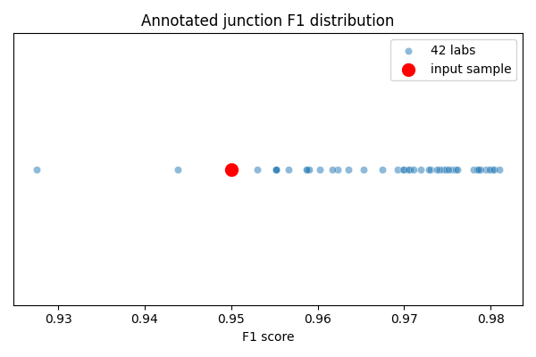
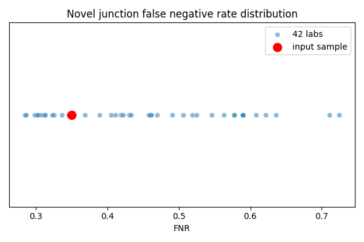
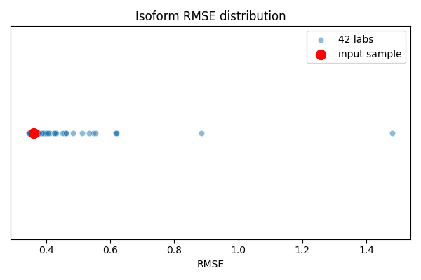
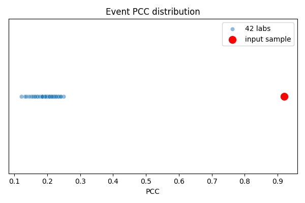

# Reference-based Quality Scores

## 2. Reference-based Quality Scores

A unified analysis workflow based on **STAR-StringTie-SUPPA2** is used to assess the quality of the input RNA-seq data against the reference dataset.

This directory contains the current implementation:

```text
reference_quality/
├── data/
│   ├── 42_lab_consistency_distribution_clean.csv
│   ├── 42_lab_consistency_distribution.csv
│   ├── Junction_anotated_truth.csv
│   ├── Junction_novel_truth.csv
│   ├── Ratio-based_AS_reference_datasets.csv
│   ├── Ratio-based_DAS_reference_datasets.csv.csv
│   ├── RefData_DEIs_all_isoforms_classified_u_20250522.csv
│   └── ref_expr_b7_p4_s84_u_20250516.csv
├── figures/
│   ├── event_pcc_distribution.png
│   ├── isoform_rmse_distribution.png
│   ├── junction_f1_distribution.png
│   └── junction_novel_fnr_distribution.png
├── output/
│   ├── event_quality_scores.tsv
│   ├── isoform_quality_scores.tsv
│   └── junction_quality_scores.tsv
└── scripts/
    ├── compute_event_pcc_scores.py
    ├── compute_isoform_rmse_scores.py
    ├── compute_junction_quality_scores.py
    ├── compute_reference_quality.py
    └── plot_reference_quality_distributions.py
```

The cleaned 42-laboratory reference table currently used in the workflow is:

- `data/42_lab_consistency_distribution_clean.csv`

---

## 2.1 Splicing Junction Detection

Splicing junction detection is evaluated using the `SJ.out.tab` files generated by **STAR**.  
The detected junctions from the input data are compared with the reference junction dataset to quantify consistency.

### Reference dataset definition

The reference dataset includes two classes of junctions:

- **Annotated junctions**: defined as both `Y_H` and `N_H`, representing all high-confidence positive and negative junctions within a gene
- **Novel junctions**: defined as `Y_H`, representing novel junctions observed in the sample

### Evaluation rules

#### Annotated junctions

For annotated junctions, the evaluation is restricted to the **intersection of genes** between the input data and the reference dataset.

Within the intersected gene set:

- A detected junction that is consistent with `Y_H` is counted as a **true positive (TP)**
- A junction expected to be `Y_H` but not detected consistently is counted as a **false negative (FN)**
- A detected junction outside the `Y_H` set is counted as a **false positive (FP)**
- A junction not detected and not belonging to `Y_H` is counted as a **true negative (TN)**

Based on these counts, the **F1 score** is calculated.

#### Novel junctions

For novel junctions, the **false negative rate (FNR)** is calculated directly.

### Current files used

- Input/reference files:
  - `data/Junction_anotated_truth.csv`
  - `data/Junction_novel_truth.csv`
- Output file:
  - `output/junction_quality_scores.tsv`

### Quality score calculation

The quality score is calculated based on the rank of the input data among the **42 laboratories**:

```text
Quality score = (42 - rank) / 42
```

A quality score **greater than 50%** is considered **passing**.

### Visualization

Scatter plots show the position of the input data relative to the 42-laboratory background distribution for:

- **Annotated junction F1 score**
- **Novel junction false negative rate**

#### Annotated junction F1


#### Novel junction false negative rate


---

## 2.2 Isoform Quantification

Isoform quantification consistency is evaluated using the **log2FC(TPM)** results derived from the unified STAR-StringTie-SUPPA2 workflow.

The consistency between the input data and the reference dataset is quantified using **RMSE**.

### Current files used

- Input/reference files:
  - `data/Ratio-based_AS_reference_datasets.csv`
  - `data/ref_expr_b7_p4_s84_u_20250516.csv`
- Output file:
  - `output/isoform_quality_scores.tsv`

### Quality score calculation

The cleaned 42-laboratory reference table provides the RMSE values between the 42 laboratories and the reference dataset.

For the RMSE calculated from the input data, the quality score is determined according to its rank among the 42 laboratories:

```text
Quality score = (42 - rank) / 42
```

A quality score **greater than 50%** is considered **passing**.

### Visualization

Scatter plots show the position of the input RMSE relative to the RMSE distribution across the 42 laboratories.

#### Isoform RMSE


---

## 2.3 Event Quantification

Event quantification consistency is evaluated using the **dPSI** results derived from the unified STAR-StringTie-SUPPA2 workflow.

The consistency between the input data and the reference dataset is quantified using **PCC**.

### Current files used

- Input/reference files:
  - `data/Ratio-based_DAS_reference_datasets.csv.csv`
  - `data/RefData_DEIs_all_isoforms_classified_u_20250522.csv`
- Output file:
  - `output/event_quality_scores.tsv`

### Quality score calculation

The cleaned 42-laboratory reference table provides the PCC values between the 42 laboratories and the reference dataset.

For the PCC calculated from the input data, the quality score is determined according to its rank among the 42 laboratories:

```text
Quality score = (42 - rank) / 42
```

A quality score **greater than 50%** is considered **passing**.

### Visualization

Scatter plots show the position of the input PCC relative to the PCC distribution across the 42 laboratories.

#### Event PCC


---

## Scripts currently used

The current workflow scripts are:

- `scripts/compute_junction_quality_scores.py`
- `scripts/compute_isoform_rmse_scores.py`
- `scripts/compute_event_pcc_scores.py`
- `scripts/compute_reference_quality.py`
- `scripts/plot_reference_quality_distributions.py`

A typical execution order is:

```bash
cd reference_quality
python3 scripts/compute_reference_quality.py
python3 scripts/plot_reference_quality_distributions.py
```

---

## Interpretation

The reference-based quality score framework summarizes the agreement between the input data and the reference dataset at three levels:

- **Splicing junction detection**
- **Isoform quantification**
- **Event quantification**

For all three categories, the quality score is rank-based and normalized to the 42-laboratory reference background.

General interpretation:

- **Quality score > 50%**: pass
- **Quality score <= 50%**: fail

---

## Current output files

The current workflow produces:

```text
reference_quality/
├── output/
│   ├── event_quality_scores.tsv
│   ├── isoform_quality_scores.tsv
│   └── junction_quality_scores.tsv
└── figures/
    ├── event_pcc_distribution.png
    ├── isoform_rmse_distribution.png
    ├── junction_f1_distribution.png
    └── junction_novel_fnr_distribution.png
```

---

## Markdown Figure Display Structure

To display the figures correctly in Markdown, keep the following relative path structure:

```text
reference_quality/
├── reference_based_quality_scores.md
└── figures/
    ├── event_pcc_distribution.png
    ├── isoform_rmse_distribution.png
    ├── junction_f1_distribution.png
    └── junction_novel_fnr_distribution.png
```
